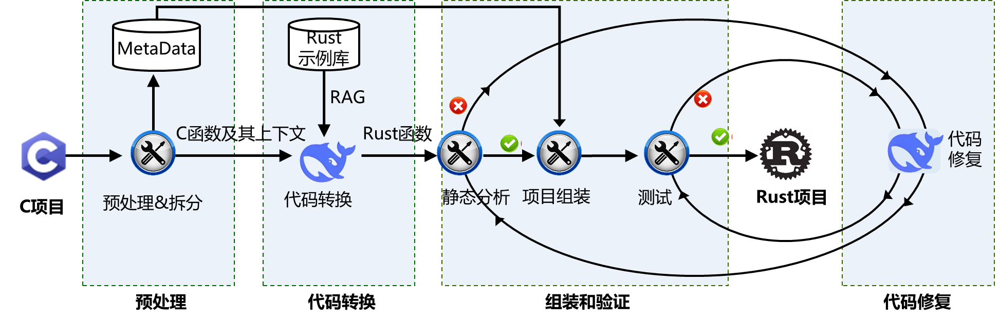
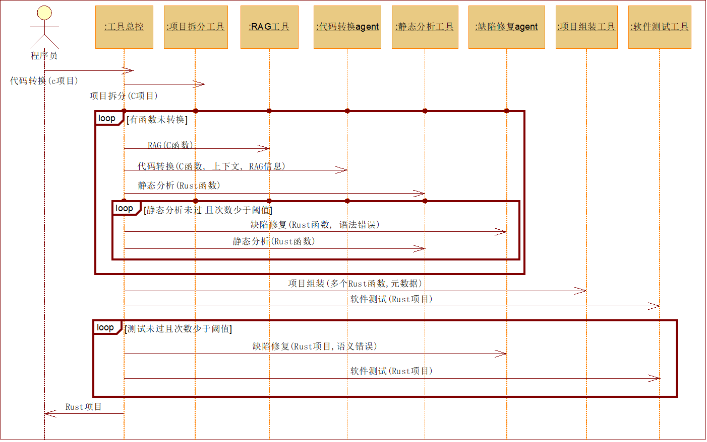
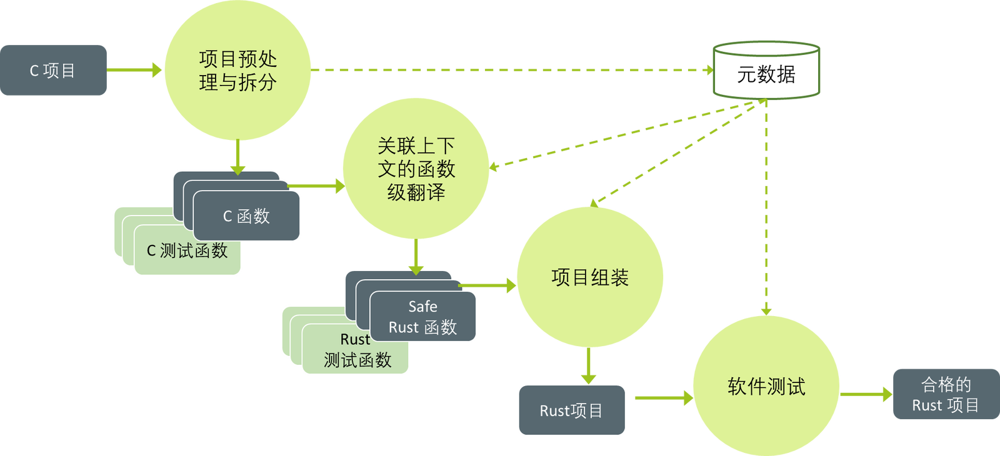

# **基于多Agent的C-to-Rust代码翻译**

# **一、摘要**

​        Rust 语言以其卓越的安全特性和高性能在系统编程领域迅速崛起，而 C 语言作为历史悠久的经典编程语言，积累了丰富的代码库和广泛应用。随着对安全性和稳定性要求的不断提升，将现有的 C 语言代码库迁移到 Rust 成为了一个亟待解决的关键问题。为此，我们开发了 C2RustAgent——一款基于大模型多智能体（Multi-Agent）技术的高效 C 至 Rust 代码转换工具。通过基于程序分析的项目拆分、开源 Rust 代码库的检索增强生成、以及基于代码静态分析和动态测试反馈的缺陷迭代修复，C2RustAgent 实现了项目级 C 代码到 Rust 的自动转换，不仅简化了复杂的转换过程，优化了生成代码的质量，确保其符合最佳实践，而且结合代码静态分析和动态测试，自动识别并修复潜在缺陷，确保转换后的代码正确无误。相较于传统的基于规则的 c2rust 方法，C2RustAgent 转换出的 Rust 代码不仅安全性更高，而且非常接近由经验丰富的工程师手工编写的代码，显著提升了代码的质量和可维护性。

# **二、开放源码许可证**

本项目采用以下开放源码许可证发布：

- MIT License

# **三、软件基本信息**

- **作品标题**：基于多Agent的C-to-Rust代码翻译

- **版本**：v1.0

- **作者/团队**：这里有个好名队

- **联系方式**：yin_zhe@sjtu.edu.cn

- **软件分类**：代码转换工具

# **四、作品概述**

## **4.1、背景及应用领域**

### **4.1.1、软件开发的背景**

​        随着网络安全威胁日益增加，内存安全问题已成为一个亟待解决的挑战。C语言虽然高效灵活,但其指针操作和手动内存管理容易导致各类安全漏洞。Rust作为一门现代系统级编程语言,通过所有权系统和借用检查器在编译期就能预防内存安全问题。将C代码迁移到Rust是提升软件安全性的重要手段。

手动将C代码重写为Rust是一项耗时且容易出错的工作，主要面临以下挑战:

- 语言特性差异大：C和Rust在内存管理模型、类型系统等方面存在本质区别

- 代码逻辑复杂：需要正确理解原始C代码的意图并用Rust等价实现

- 测试验证困难：需确保翻译后的代码功能与原代码一致

为了应对上述挑战，本项目采用多个专业化的AI Agent协同工作，以实现提高转换的准确性和可靠，实现更细致的错误处理和优化，加快代码翻译的效率。

### **4.1.2、目标用户群体**

本软件的目标用户群体是安全关键软件系统的软件工程师，主要包括：

- 系统与基础设施开发团队，例如操作系统开发团队需要逐步将系统组件从C迁移到Rust，驱动程序开发者希望提高设备驱动程序的安全性和可靠性，基础设施维护团队负责关键基础设施代码的现代化升级，系统集成商需要确保系统各组件间的兼容性和安全性。

- 安全关键应用软件的开发者，例如金融科技团队中的交易系统开发者、支付系统架构师、风控系统开发团队；医疗软件开发团队中的医疗设备固件开发者、医疗数据系统开发团队；航空航天软件工程开发团队中的飞行控制系统开发者、导航系统程序员、航天器控制软件开发团队等。

- Rust语言的学习者，他们已掌握C语言，正在学习Rust语言，本工具通过从C代码转换成Rust代码，让他们更好地理解和掌握Rust。

### **4.1.3、预期的应用场景**

- 遗留系统的现代化改造（ legacy system modernization）：该工具可以帮助将旧的C代码库迁移到Rust，从而利用现代安全特性而不必从头重写。

- 跨平台开发：工具可以生成针对不同平台的Rust代码，充分利用Rust的跨编译能力。

- 安全关键软件系统的开发：在汽车和航空航天等行业，安全关键系统可以从C迁移到Rust，以提高可靠性和满足更严格的安全标准。

- 与CI/CD集成：与CI/CD管道的集成允许自动测试和部署转换后的代码，确保迁移过程的无缝衔接和可靠性。

## **4.2、作品特点和设计思路**

### **4.2.1、作品特点**

本项目致力于将C语言代码高效、准确地转换为Rust语言代码，并在此过程中确保代码的可读性和安全性。为了实现这一目标，我们结合了程序分析和大模型技术，引入了Rust社区的丰富资源，并进行了创新。具体特点为：

- **基于代码解析，进行自底向上代码翻译。**通过代码解析技术，将C项目拆分为多个模块，根据调用关系从底向上进行各模块的翻译，提高翻译效率和准确性。支持复杂项目结构的翻译，包括多文件、多目录、宏定义、预处理指令等。

- **构建Rust示例库，进行检索增强生成。**构建了Rust示例库，涵盖了Rust语言的语法、标准库、常用库和社区最佳实践。在翻译过程中，检索Rust示例库中相关的代码片段，并将其融入到LLM的翻译提示词中，提高翻译代码的质量和可读性。

- **基于代码静态分析与动态测试，进行多轮代码缺陷修复。**引入代码静态分析工具和编译器错误信息，精准定位翻译后的Rust代码中的语法缺陷；代码组装后，采用动态测试，反馈Rust代码中的语义缺陷。利用大模型分析错误信息，自动生成修复方案，并对代码进行多轮修复，直至代码通过编译和测试，或者达到最大阈值。

### **4.2.2、设计思路**

​        C 到 Rust 的代码转换是一个复杂且具有挑战性的任务，主要由于 C 语言的灵活性和不安全特性与 Rust 语言的强安全性和内存管理机制之间的根本差异。为了解决这一难题，我们结合程序分析和大模型技术，研究开发了C2RustAgent工具 。

​        C2RustAgent工具采用多Agent、RAG、基于反馈的迭代修复技术，调用LLM和静态分析工具，构建翻译工作流，完成项目级C到Rust的代码翻译。具体地，首先通过对C代码进行预处理和拆分，将代码中的函数及相关元数据提取出来，并存储在MetaData中，为后续函数级翻译提供支持。然后，按MetaData中的调用图，从底向上进行每个函数的翻译。针对每个C函数，采用RAG技术从Rust示例库检索到合适的代码示例，从元数据中提取上下文，组合成提示词输入LLM，生成初步的Rust代码。所生成的Rust代码通过静态分析工具进行检查，识别潜在的语法问题，让LLM进行修复。接着，将能编译的代码组装成完整的Rust项目，进行测试，检测是否存在运行时错误或功能性问题。对于测试未通过的代码，将返回到LLM进行修复，形成一个闭环的优化流程，确保最终生成的 Rust 代码兼具正确性、安全性和高效性。

## **4.3、功能描述**

1）项目拆分和组装: 对原始C项目代码进行预处理、拆分与结构化分析，生成适用于后续代码转换的元数据；并在代码转换后，将代码重组，实现项目级代码翻译。

2）代码转换：将C代码转换为Rust代码，依赖于C语言代码和Rust代码示例库。它分析C代码元素并转换为Rust，还将翻译后的Rust代码和函数签名写入元数据结构中。

3）检索增强生成：辅助C到Rust代码转换，通过在Rust知识库中检索相似Rust代码作为参考，帮助生成更准确的Rust代码，提高转换质量。

4）代码验证：采用代码静态分析工具对翻译后的Rust代码进行语法检查，采用动态测试方法对组装后的Rust代码进行语义验证，以确保代码质量。

5）代码错误修复：根据代码验证时发现的语法和语义错误，进行代码错误修复的策划和实施，修复后的代码会重新验证，直至满足质量标准，或者达到最大修复次数阈值。

## **4.4、体系结构和关键技术点**

### **4.4.1、C2RustAgent架构图**



<center>图1 C2RustAgent工具的架构图</center>

​        C2RustAgent的架构如图1所示，本项目提出了一种新颖的多Agent协同工作机制，用于自动化处理C到Rust的代码转换。这种机制通过将转换任务分解为预处理、代码转换、组装验证和代码修复四个核心阶段，由不同的专家Agent和工具分别处理。在预处理阶段，系统使用Tree-sitter进行语法分析并生成元数据；代码转换阶段采用基于RAG技术的语法转换Agent进行初步转换；组装验证阶段结合静态分析工具和自动化测试框架进行代码验证；代码修复阶段则通过修复规划Agent和修复Agent进行迭代优化。这种分布式的转换方法能够更有效地处理复杂的代码转换问题，因为其允许每个Agent深入专研并优化其负责的特定领域，同时通过完整的验证和反馈优化循环确保了转换结果的质量，从而提高整体转换的准确性和效率。

C2RustAgent工具由以下关键组件组成：

**1）项目预处理与拆分工具**

项目预处理与拆分工具主要负责对C项目进行初始化处理和依赖分析。首先通过代码清理与标准化，移除注释、调试代码等；然后使用Tree-sitter解析器构建语法树，分析项目结构和函数间的依赖关系；最后生成包含代码结构、依赖关系等信息的元数据，为后续转换提供基础。

**2）RAG工具**

RAG工具在相似代码库中检索与待转换代码相似的Rust代码，供代码转换agent作为参考，以提高转换质量。具体地，该工具首先对输入的C代码进行向量化，在相应知识库中检索相似代码；对于测试代码，则使用专门的测试代码知识库进行检索。然后将检索到的相似代码作为参考示例提供给代码转换agent。

**3）代码转换agent**

代码转换agent会首先将C项目中的结构体、宏定义、变量等，转换为对应的Rust代码，作为后续函数级翻译的上下文；之后根据预处理阶段得到的函数调用图，自底向上的进行函数级翻译，同时在翻译过程中将翻译后的Rust代码和函数签名写入元数据结构中，为后续其他函数翻译提供上下文。

**4）静态分析工具**

静态分析工具主要负责对代码翻译模块生成的Rust代码进行语法错误检查。为此，我们采用Rust官方维护的Lint静态分析工具Clippy来对代码进行审查。Clippy能够检测出Rust代码中的多种语法问题，包括由rustc编译器返回的语法错误。对于检测到的语法错误，每条错误信息将包括以下内容：错误描述、可能的修改建议、具体的错误代码以及其发生的位置。这些错误信息将被传递给代码修复模块，以便进一步改进和优化代码质量。

**5）缺陷修复agent**

缺陷修复agent负责接收并处理来自静态分析或测试的错误信息，结合C源码和Rust问题代码，提供具体的修复建议，对存在问题的Rust代码进行修复和优化，并将优化后的代码重新交由静态分析或测试模块进行验证。

**6）项目组装工具**

项目组装工具主要负责管理转换后代码的重组。通过处理函数依赖关系，引入对应的crate，将翻译后的函数级别的rust代码和结构体变量等上下文信息组织起来，提供给测试模块进行测试。

各工具的协同如图2时序图所示。



<center>图2 C2RustAgent工具的时序图</center>

### **4.4.2、技术栈**

- **编程语言：Python**

Python是一种广泛使用的高级编程语言，以其清晰的语法和代码可读性而闻名。在本项目中，Python被用作主要的开发语言。

- **深度学习框架：PyTorch**

PyTorch是一个开源的机器学习库，广泛用于计算机视觉和自然语言处理领域。它提供了强大的GPU加速的张量计算能力，以及构建深度学习模型的动态计算图。

- **大语言模型（LLM）：DeepSeek V2.5**

DeepSeek V2.5是一个先进的大语言模型，DeepSeek V2.5是DeepSeek-V2-Chat和DeepSeek-Coder-V2的合并升级版本，它不仅保留了原有Chat模型的通用对话能力，还继承了Coder模型的代码处理能力，并更好地对齐了人类的偏好。DeepSeek V2.5以其强大的通用能力和代码处理能力，广为开发者和研究者们使用。

- **嵌入技术（Embedding）：text-embedding-ada-002**

采用ChatGPT的文本嵌入模型text-embedding-ada-002，将文本数据转换为高维空间中的向量表示，这些向量能够捕捉文本的语义信息。

- **代码静态分析工具：Clippy**

Clippy是Rust语言的官方Lint工具，用于检测Rust代码中的潜在错误和不一致性。在项目中，Clippy用于对转换后的Rust代码进行语法错误检查，确保代码的质量和一致性。

### **4.4.3、关键技术**

**1）项目预处理、拆分和组装**



<center>图3 项目拆分和组装</center>

​        针对项目级代码翻译，主要有依赖关系处理和上下文信息更新以下两个挑战，针对这两个挑战，本项目分别提出了以下解决方案。

​        挑战1：项目中的函数之间存在跨文件的复杂依赖关系，需要确定正确的翻译顺序。

​        解决方案：首先使用Tree-sitter解析器针对每个文件构建语法树，识别函数间的调用关系（直接函数调用和函数名传参），其次进行拓扑排序，之后统计每个函数被调用的次数，按照被调用次数从小到大排序，自底向上地构建函数调用图。

​        挑战2：在翻译过程中，需要保存并更新rust上下文信息，以便后续函数翻译、修复和测试过程中使用。

​        解决方案：使用 json形式的元数据结构存储项目信息。在翻译函数时，对元数据进行实时更新，将翻译后的rust代码和函数签名写入元数据结构中，为后续其他函数翻译提供上下文，并且在项目重组时，也使用元数据结构进行重组。

**2）基于验证反馈的错误修复**

​        挑战1：在对静态分析出错的代码进行修复时，遇到的主要挑战是由于prompt的设计欠佳，LLM给出的修复建议容易过于笼统导致没有参考价值，或严重偏离原有语义。

​        解决方案：重新设计prompt，加入原始C代码帮助保持语义，并要求LLM明确错误位置及修复代码。

​        挑战2：在对未能通过单元测试的代码进行修复时，主要面对的挑战是对依赖复杂的函数，难以定位其出错位置。

​        解决方案：将单元测试依赖的函数代码合并在一起共同进行修复，由大模型判断可能的错误位置及原因。

**3）基于代码示例的检索增强生成**

​        RAG面临的主要挑战在于如何高效且准确地检索相关代码示例以及确保检索到的代码示例质量高，相关性强。

对此本项目采取以下解决方案：

​        使用先进的向量化技术： 通过OpenAI的Embedding模型将代码转换为高维向量，捕捉代码的语义特征，从而实现更准确的相似度匹配。

​        建立独立的测试代码知识库： 针对测试函数，使用专门的测试代码知识库进行检索，确保测试代码的相关性和正确性。

## **4.5、功能模块设计**

### **4.5.1、项目预处理、拆分和组装模块**

​        本模块主要负责对原始C项目代码进行预处理、拆分与结构化分析，生成适用于后续代码转换的元数据，并在翻译后进行项目重组。具体步骤如下：

- 代码清理与标准化：移除C风格注释和多余的调试代码，同时处理头文件保护和C++兼容性代码，并清理内存分配相关的测试代码。

- 结构分析与依赖提取：对文件分类，区分头文件(*.h)、源文件(*.c)和测试文件(test-*.c)。利用Tree-sitter解析器构建语法树，分析函数间的调用关系（直接依赖和间接依赖），利用拓扑排序算法以及依赖函数数量排序以自底向上的方式生成完整的函数调用图。

- 元数据生成：在分析的基础上，为每个源文件和测试文件生成详细的元数据，包含函数签名、文件依赖、头文件信息，以及变量和结构体定义等。此外，元数据中还预留了Rust代码转换的相关字段。针对特殊情况，我们进行了处理，包括函数指针作为参数的特殊用法、函数间的循环依赖，以及条件编译指令等。

- 项目重组：提取元数据中翻译后的Rust代码，按照C项目类似的结构，引入对应的crate，将翻译后的函数级别的Rust代码和结构体变量等上下文信息组织起来，提供给测试模块进行测试。

### **4.5.2、检索增强生成模块**

​        本模块通过检索相关的 Rust 代码片段和模板，提升 C 到 Rust 转换过程的准确性与效率。主要流程包括知识库构建与维护、语义相似度计算与匹配、上下文整合与生成辅助，以及生成结果验证与反馈优化。  

- 知识库构建与维护: 知识库是本模块的核心，构建与维护过程中需要系统性地收集高质量的 Rust 代码样例、转换模板和相关文档，构建全面的资源库。收集到的样例通过对功能模块、代码结构及使用的库进行合理划分，确保检索时能够快速定位到最相关的内容。此外，知识库需要定期更新和扩展，持续引入最新的 Rust 代码样例和最佳实践，从而保持其内容的时效性和高效性，满足动态转换需求。  

- 语义相似度计算与匹配：在代码转换过程中，利用语义分析技术对待转换的 C 代码与知识库中的 Rust 样例进行匹配。通过将代码片段转化为语义向量，并采用余弦相似度，评估它们之间的相似度，从而筛选出与当前需求最契合的 Rust 代码片段。这一过程为生成阶段提供了直接的参考与支持，有效提升了转换的精准性。  

- 上下文整合与生成辅助：基于语义匹配得到的 Rust 样例，将其与当前的 C 代码片段融合，形成完整的上下文信息，以辅助生成模型的工作。结合这些上下文，可以优化生成模型的提示，引导其生成更加贴合需求的 Rust 代码。同时，在特定场景下，可以通过引入预定义的转换模板，确保生成代码在风格和结构上的一致性，进一步提升代码生成的质量与效率。  

- 生成结果验证与反馈优化：生成的 Rust 代码需经过严格的验证过程，确保其质量与功能正确性。通过静态分析检查语法错误、类型匹配问题及逻辑漏洞，并结合动态测试验证其运行性能和实际功能表现。在此基础上，将验证结果反馈到检索系统和生成模型中，优化匹配算法和生成策略，实现模块性能的持续改进和转换质量的逐步提升。 

### **4.5.3、代码转换模块**

​        代码转换模块是系统的核心组件，负责将C函数高效地转换为Rust函数。该模块在检索增强生成模块的辅助下，通过调用大模型，实现高质量的代码转换，并通过迭代优化确保转换效果。

​        代码转换采用分层递进策略。给定待转换的C函数，首先利用检索增强生成模块从知识库中检索相似的Rust代码作为参考，然后读取元数据，构建提示词，调用大模型进行关联项目上下文的函数级代码转换。随后，所生成的基础Rust函数使用Rust静态分析工具检查代码质量，并通过多轮迭代优化代码。最后，与其他转换生成的函数进行集成，采用动态测试来验证语义正确性，形成闭环优化机制。

​        由于C和Rust语言的特性差异，我们将C中常见的结构体、函数、循环结构用Rust语言实现了对应的具有相同功能的版本，具体内容见Tool/translation_utils.

### **4.5.4、代码**错误修复模块

本模块主要负责对转换生成的Rust代码进行静态分析与动态测试，然后对无法通过验证的错误代码进行修复。具体步骤如下：

- 代码验证：静态分析使用Clippy工具，检查代码风格、潜在运行时错误和性能问题，并生成问题报告。动态测试执行预定义测试用例，验证功能正确性，并收集运行时信息。

- 修复规划：将验证发现的错误信息、错误代码、原始代码及上下文信息提供给规划专家，规划专家定位错误并给出修复规划。

- 代码修复：修复专家判断修复规划是否采纳，对错误代码进行修复。

​        验证与修复采用迭代的过程，修复后的代码将重新进行静态分析和动态测试，直至通过验证或者达到最大阈值。

# **五、创新点**

## **1）基于项目元数据的自底向上的函数转换**

​        通过tree-sitter进行代码解析，并在拓扑排序算法的基础上增加依赖函数数量排序，将项目级代码翻译转变成关联项目上下文的函数级翻译。使用JSON元数据存储项目的函数信息、依赖及上下文，按依赖关系自底向上逐步转换过程中及时更新状态，支持增量转换以及转换完成后Rust函数的集成。

## **2）基于Rust示例库的检索增强生成**

​        检索增强生成（Retrieval-Augmented Generation，RAG）是一种结合了检索与生成的自然语言处理技术，通过在知识库中检索相关数据来增强模型的生成能力。本项目在基于大模型的翻译技术中引入RAG，收集开源社区中的Rust项目的代码构建Rust示例库，将检索到的Rust代码片段加入提示，来提高大模型转换代码的质量。

## **3）基于分析与测试的多轮缺陷修复** 

​        将C语言代码转换为Rust语言时，确保翻译后的代码能成功通过编译并保持正确的功能是一个巨大的挑战。对此我们引入了一套先进的缺陷修复机制，结合静态分析工具与软件测试采集代码错误信息，包括错误类型、错误位置等，再使用大模型对错误信息进行分析，自动生成修复规划，并对代码进行修复。


# **六、如何运行**

## **6.1**、环境准备

- [操作系统]：linux、windows

- [依赖项]：rust clippy、tree-sitter、rag代码库

tree-sitter可以通过运行以下命令进行安装：

```bash
python Tool/tree_sitter/tree_sitter_build.py
```
rag代码库请放在Tool/rag_db和Tool/rag_db_test目录下

## **6.2**、安装步骤(Docker)

- 进入源代码根目录 
```bash
cd c_rust_agents/
```

- 构建镜像

```bash
docker build -t c_rust_agents .
```

- 运行命令

```bash
docker run -d --user root -v "$PWD":/usr/src/c_rust_agents -w /usr/src/c_rust_agents c_rust_agents tail -f /dev/null
```

- 运行命令查看先前运行的\<container id\>

```bash
docker ps
```

- 运行命令进入容器

```bash
docker exec -it <container id> bash
```

- 进入容器后，修改Tool/LLM_config.py中的deepseek_key和gpt4_key为可用的api key（建议使用siliconflow api，因为deepseek刚升级完，模型不稳定，容易导致输出结果差别较大）

- 修改后，所有安装步骤已完成

## **6.3**、运行程序

- [启动命令]：bash run.sh 

- [测试命令]：pytest Tool/test

# **致谢**

感谢所有为本项目做出贡献的人们！

版权声明 © [年份] [版权所有者]. 根据上述许可证条款授权。